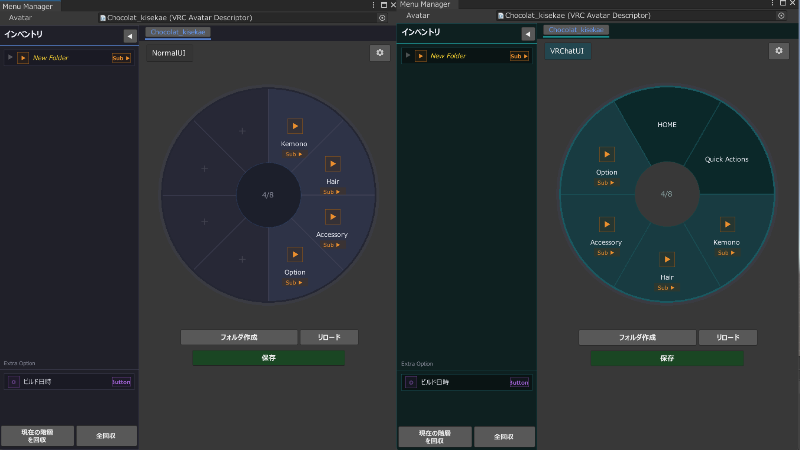

# Lyra Menu Manager

## 概要

VRChatのエクスプレッションメニューおよび、Modular Avatarによって導入される拡張メニュー群を、VRChat内メニューと同様の円形UIで視覚的に整理・編集できるUnityエディター拡張ツールです。

Modular Avatarによる多数のギミック追加により複雑化・肥大化しがちなメニュー構造を、ドラッグ＆ドロップなどの簡単な操作で、非破壊に整理することが可能です。自分好みの見やすいカスタム階層の構築をサポートします。

---

## 主な特徴

### UI

VRChatゲーム内と同じレイアウトのメニューUIをエディター上にそのまま再現しています 
完成イメージを直接見ながら、迷うことなく編集が可能です。

### ドラッグ＆ドロップ操作

アイテムを掴んでドラッグし、順番の入れ替えやサブメニューへの移動など、直感的に階層を組み替えることができます。

### Modular Avatar 完全対応

標準のExpression Menuに加えて、アバター内に分散している `MA Menu Installer` を自動で集約・リストアップするため、ヒエラルキー内に散らばったメニュー設定を探し回る必要がありません。 
また、参照を記憶するため、どのメニューアイテムがどのオブジェクトのMAから追加されているかをワンクリックで確認できます。

### インベントリシステム

メニューに登録したくないアイテムや、一時的に整理しておきたいアイテムを、左パネルのインベントリに収納できるシステムを実装しています。
インベントリ内ではUnityのヒエラルキーのように一覧で確認ができ、ここにある場合はメニューに登録されません。

### NDMF経由の完全非破壊での適用

変更したメニューのレイアウト情報は独自の専用コンポーネントに保存され、ビルド実行時にNDMFに介入し自動でメニューに適用されます。元のMAコンポーネントやアセットを書き換えず、コンポーネントの削除で元通りにすることが可能です。

---

## 動作確認環境

| 項目 | 要件 |
|------|------|
| Unity | 2022.3.22f1 |
| VRChat SDK | 3.10.1  |
| Modular Avatar | 1.16.2 |
| NDMF | 1.11.0 |
